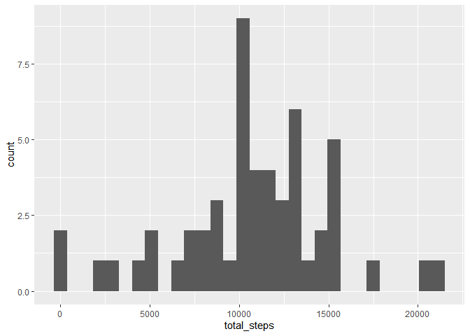
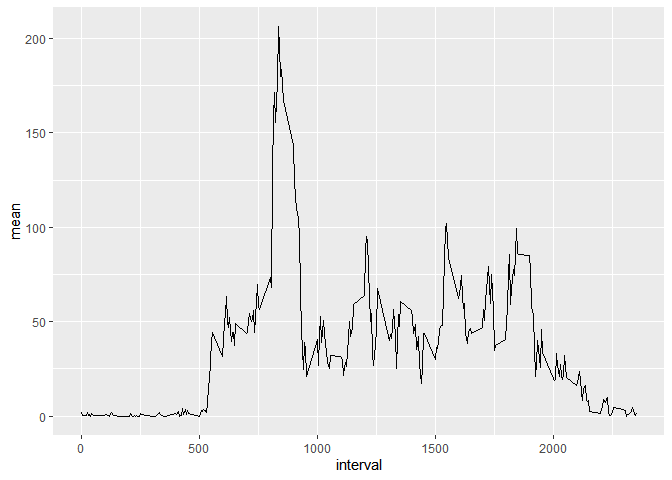
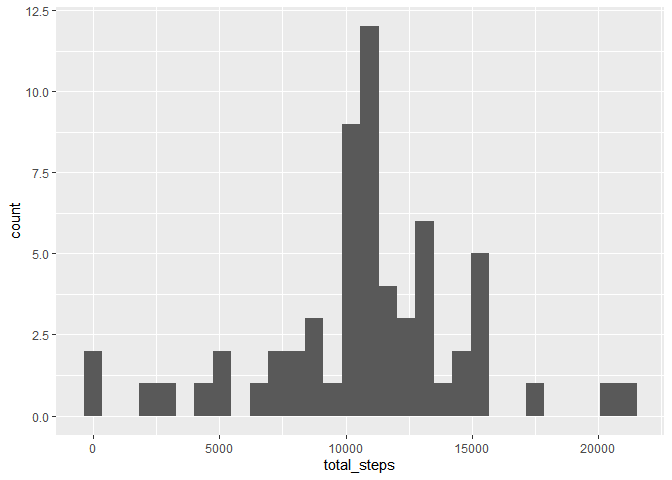
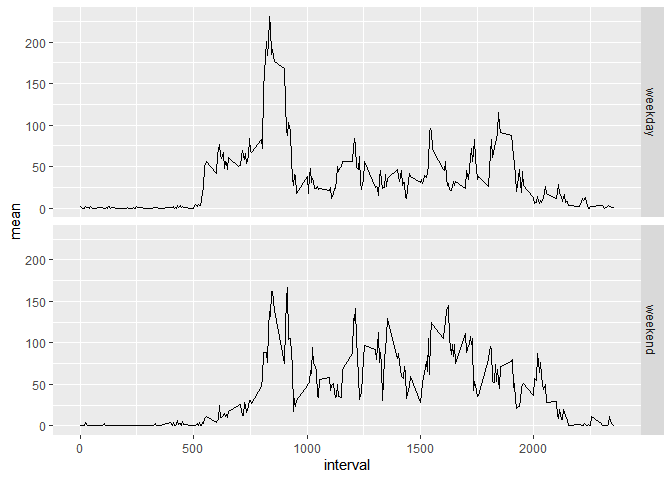

## Loading and preprocessing the data
1. Load the data (i.e. `read.csv()`)


```r
rawdata <- read.csv("activity.csv")
```

2. Process/transform the data (if necessary) into a format suitable for your analysis


```r
rawdata$date <- as.Date(rawdata$date, format("%Y-%m-%d"))
```


## What is mean total number of steps taken per day?
For this part of the assignment, you can ignore the missing values in
the dataset.

1. Make a histogram of the total number of steps taken each day

```r
library(dplyr)
library(ggplot2)

data <- rawdata[!is.na(rawdata$steps) ,]
sum <- group_by(data, date)
sum <- summarise(sum, total_steps = sum(steps))
ggplot(sum, aes(x=total_steps)) + stat_bin( geom = "bar")
```

<!-- -->

2. Calculate and report the **mean** and **median** total number of steps taken per day

```r
means <- summarise(group_by(data,date), mean = mean(steps), median = median(steps))
means
```

```
## # A tibble: 53 x 3
##    date         mean median
##    <date>      <dbl>  <dbl>
##  1 2012-10-02  0.438      0
##  2 2012-10-03 39.4        0
##  3 2012-10-04 42.1        0
##  4 2012-10-05 46.2        0
##  5 2012-10-06 53.5        0
##  6 2012-10-07 38.2        0
##  7 2012-10-09 44.5        0
##  8 2012-10-10 34.4        0
##  9 2012-10-11 35.8        0
## 10 2012-10-12 60.4        0
## # ... with 43 more rows
```

```r
summary(means)
```

```
##       date                 mean             median 
##  Min.   :2012-10-02   Min.   : 0.1424   Min.   :0  
##  1st Qu.:2012-10-16   1st Qu.:30.6979   1st Qu.:0  
##  Median :2012-10-29   Median :37.3785   Median :0  
##  Mean   :2012-10-30   Mean   :37.3826   Mean   :0  
##  3rd Qu.:2012-11-16   3rd Qu.:46.1597   3rd Qu.:0  
##  Max.   :2012-11-29   Max.   :73.5903   Max.   :0
```

## What is the average daily activity pattern?

1. Make a time series plot (i.e. `type = "l"`) of the 5-minute interval (x-axis) and the average number of steps taken, averaged across all days (y-axis)


```r
sum2 <- group_by(data, interval)
sum2 <- summarise(sum2, mean = mean(steps))
ggplot(sum2, aes(x=interval, y=mean))+geom_line()
```

<!-- -->

2. Which 5-minute interval, on average across all the days in the dataset, contains the maximum number of steps?


```r
sum2$interval[sum2$mean==(max(sum2$mean))]
```

```
## [1] 835
```

## Imputing missing values

1. Calculate and report the total number of missing values in the dataset (i.e. the total number of rows with `NA`s)


```r
sum(is.na(rawdata$steps))
```

```
## [1] 2304
```

2. Devise a strategy for filling in all of the missing values in the dataset. The strategy does not need to be sophisticated. For example, you could use the mean/median for that day, or the mean for that 5-minute interval, etc.

I replace de NAs with the mean for that 5-minute interval, which are stored in sum2.


```r
nas <- rawdata[is.na(rawdata$steps),]

for(i in 1:length(nas$steps)){
  if(length(sum2$mean[sum2$interval == nas[i,3]]) > 0){
    nas[i,1] <- sum2$mean[sum2$interval == nas[i,3]]
  }else{
    nas[i,1] <- 0
  }
}
```

3. Create a new dataset that is equal to the original dataset but with the missing data filled in.


```r
newdata <- rawdata
newdata[is.na(newdata$steps),] <- nas
```

4. Make a histogram of the total number of steps taken each day and Calculate and report the **mean** and **median** total number of steps taken per day. Do these values differ from the estimates from the first part of the assignment? What is the impact of imputing missing data on the estimates of the total daily number of steps?


```r
sum1 <- group_by(newdata, date)
sum1 <- summarise(sum1, total_steps = sum(steps), mean = mean(steps), median = median(steps))
ggplot(sum1, aes(x=total_steps)) + stat_bin( geom = "bar")
```

<!-- -->

```r
sum3 <- group_by(newdata, interval)
sum3 <- summarise(sum3, mean = mean(steps))
ggplot(sum3, aes(x=interval, y=mean))+geom_line()
```

<!-- -->

## Are there differences in activity patterns between weekdays and weekends?

1. Create a new factor variable in the dataset with two levels -- "weekday" and "weekend" indicating whether a given date is a weekday or weekend day.


```r
newdata <- newdata %>% mutate(weekdays = weekdays(date))
```

"sábado" = "saturday" and "domingo" = "sunday"

```r
newdata <- newdata %>% mutate(week = case_when(weekdays != "sábado" & weekdays != "domingo" ~ "weekday",
                                         TRUE ~ "weekend"))

newdata$week <- as.factor(newdata$week)
```

2. Make a panel plot containing a time series plot (i.e. `type = "l"`) of the 5-minute interval (x-axis) and the average number of steps taken, averaged across all weekday days or weekend days (y-axis).


```r
newdata <- group_by(newdata, interval, week);
sumd <- summarise(newdata, mean = mean(steps))

qplot(interval, mean, data = sumd, facets= week ~ ., geom=c("line"))
```

<!-- -->
